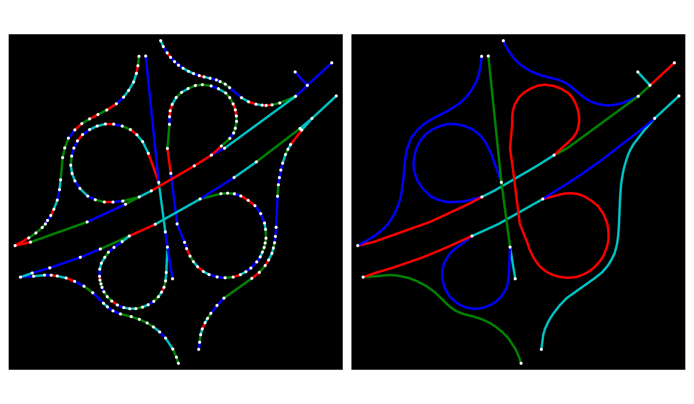

# Graph Simplification



This project provides supporting code for a [Medium blog post](https://medium.com/p/815e473b0d9f) that explores graph simplification in depth.

## Overview

This project includes two main notebooks to reproduce the graphs and information presented in the blog post. The first notebook, `01_content_creation.ipynb`, details the simplification process on a small section of a city (a grade-separated intersection in Tehran). The second notebook, `02_san_francisco.ipynb`, highlights the differences that simplification makes on a large-scale city like San Francisco.

## Usage

1.  **Installation:**

    ```bash
    pip install -r requirements.txt
    ```

2.  **Running:**

    ```bash
    Run the notebooks using Jupyter Lab.
    ```
